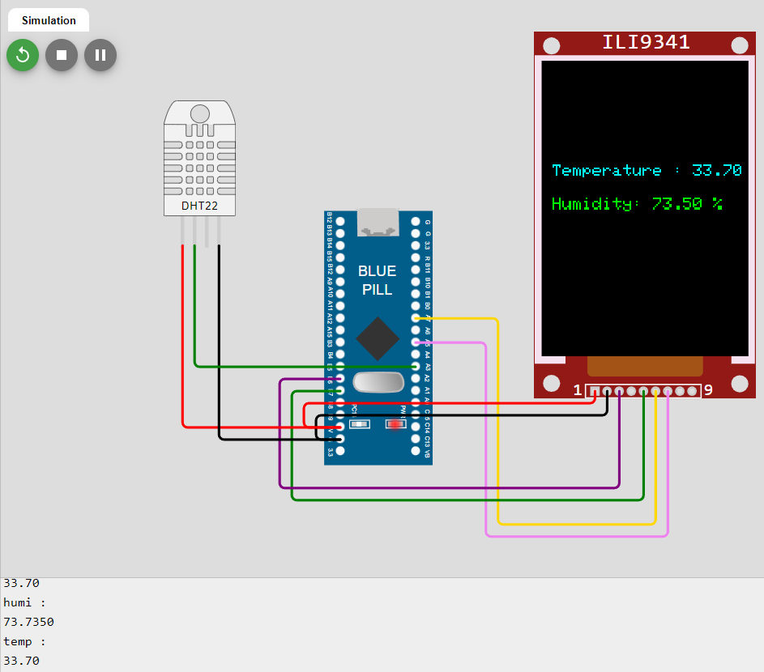

# CPS730-IoT-2023_3
Implementação de exemplo para comunicação LoRawan e leitura de sensor de umidade.

### Relatório Final
[Link para o PDF no Drive]()

### Apresentação - Vídeo e Slides
[Vídeo apresentando](https://drive.google.com/file/d/1xle-EZW6cbmSE0LirrrJ--ES2WUtmmzu/view?usp=sharing)
[Slides](https://drive.google.com/file/d/1FcQRWL2POp7D07NdcmNv92Oyw_rMkTbD/view?usp=sharing)

> Print da simulaão do Wokwi com placa STM32 e sensor DHT22

